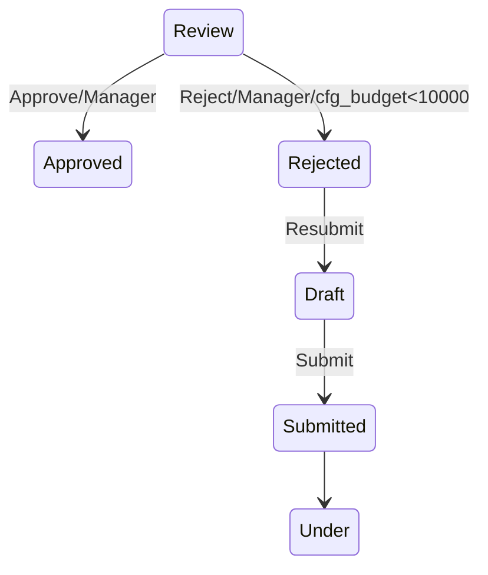

# Configuration Schema

Field lock rules and status-transition rules are stored entirely in Dataverse
configuration tables, so new rules can be created (or existing ones changed) by
an administrator without redeploying the plugin.

## `cfg_fieldlockrule` (parent)

One row per lock rule. A rule ties a specific entity + status reason combination to a
set of fields that should be locked.

| Column                     | Type              | Description                                                                                     |
|----------------------------|-------------------|---------------------------------------------------------------------------------------------------|
| `cfg_fieldlockruleid`      | Unique Identifier | Primary key.                                                                                     |
| `cfg_name`                 | Text              | Primary name / friendly label for the rule, e.g. `Claim - Pending Approval`.                    |
| `cfg_entitylogicalname`    | Text              | Logical name of the target entity, e.g. `contoso_claim`.                                        |
| `cfg_statusreasonvalue`    | Whole Number      | The `statuscode` (status reason) option set value that activates this rule.                     |
| `cfg_isactive`             | Yes/No            | Whether the rule is enabled. Inactive rules are ignored by the plugin.                           |
| `cfg_bypasssecurityrole`   | Text              | (Optional) Name of a security role that, if held by the acting user, bypasses this rule.         |
| `cfg_description`          | Multiline Text    | Free-text description of why the rule exists / what it protects.                                 |

## `cfg_lockedfield` (child, N:1 to `cfg_fieldlockrule`)

One row per field locked by a given rule.

| Column                    | Type              | Description                                                          |
|---------------------------|-------------------|------------------------------------------------------------------------|
| `cfg_lockedfieldid`       | Unique Identifier | Primary key.                                                          |
| `cfg_name`                | Text              | Primary name, e.g. `Amount`.                                          |
| `cfg_fieldlockrule`       | Lookup            | Parent lookup to `cfg_fieldlockrule`.                                 |
| `cfg_fieldlogicalname`    | Text              | Logical name of the field to lock, e.g. `contoso_amount`.             |

## Sample configuration

The example below locks the `Amount` (`contoso_amount`) and `Payee`
(`contoso_payee`) fields on the `contoso_claim` entity whenever the record's
status reason is `Pending Approval` (status reason value `100000001`), unless
the acting user holds the `Claims Administrator` security role.

```json
{
  "cfg_fieldlockrule": {
    "cfg_name": "Claim - Pending Approval",
    "cfg_entitylogicalname": "contoso_claim",
    "cfg_statusreasonvalue": 100000001,
    "cfg_isactive": true,
    "cfg_bypasssecurityrole": "Claims Administrator",
    "cfg_description": "Prevents changes to financial and payee details once a claim has been submitted for approval.",
    "cfg_lockedfield": [
      {
        "cfg_name": "Amount",
        "cfg_fieldlogicalname": "contoso_amount"
      },
      {
        "cfg_name": "Payee",
        "cfg_fieldlogicalname": "contoso_payee"
      }
    ]
  }
}
```

## Notes

- The plugin caches the active rule set in-memory for 5 minutes. Changes to
  `cfg_fieldlockrule` / `cfg_lockedfield` may take up to 5 minutes to take effect,
  or until the sandbox worker process recycles.
- `cfg_statusreasonvalue` must match the underlying integer value of the
  `statuscode` option set on the target entity, not its label.
- If `cfg_bypasssecurityrole` is left blank, the rule cannot be bypassed by any role.

---

## `cfg_statetransitiondefinition`

One row per state machine definition. Each row defines the *entire* set of valid
status-reason transitions for one entity, expressed as a [Mermaid `stateDiagram-v2`](https://mermaid.js.org/syntax/stateDiagram.html)
document. The Mermaid text is both human-readable documentation (renders as a
diagram in GitHub, Azure DevOps wikis, VS Code, etc.) and the executable
configuration enforced by the `StateTransitionEnforcer` plugin.

| Column                     | Type              | Description                                                                                     |
|----------------------------|-------------------|---------------------------------------------------------------------------------------------------|
| `cfg_statetransitiondefinitionid` | Unique Identifier | Primary key.                                                                              |
| `cfg_name`                 | Text              | Primary name, e.g. `Housing Application Workflow`.                                              |
| `cfg_entitylogicalname`    | Text              | Logical name of the target entity, e.g. `contoso_housingapplication`.                            |
| `cfg_mermaiddefinition`    | Multiline Text    | The `stateDiagram-v2` document defining valid transitions (see syntax below).                    |
| `cfg_isactive`             | Yes/No            | Whether this definition is enforced. Inactive rows are ignored by the plugin.                    |
| `cfg_version`              | Whole Number       | (Optional) version number, for change-tracking/documentation purposes only.                     |

### Mermaid syntax and transition labels

State names are matched **case-insensitively against the display labels** of the
entity's `statuscode` option set, so admins editing the diagram never need to know
numeric status reason values, e.g.:



Each transition's optional label (after `:`) follows the convention
`Action/Role/Condition`, where every segment is optional:

| Segment     | Meaning                                                                                          |
|-------------|---------------------------------------------------------------------------------------------------|
| `Action`    | Free-text description of the transition (e.g. for surfacing as a button label). Informational only, not enforced. |
| `Role`      | Name of a Dataverse security role. If present, the initiating user must hold this role for the transition to be allowed. |
| `Condition` | A simple comparison `<field><op><number>` (operators: `< <= > >= == !=`) evaluated against the field's value on the record (Target, falling back to PreImage). Supports Money, whole number, and decimal fields. |

If a transition has no label, it's allowed unconditionally for any user. Multiple
edges between the same two states (e.g. one requiring `Manager`, another
requiring a different role) are treated as alternatives — the transition is
allowed if **any** matching edge's requirements are satisfied.

Pseudo-states (`[*] --> Draft`) are valid Mermaid but are ignored by the parser
since they don't correspond to an existing status reason.

### Sample configuration

```json
{
  "cfg_statetransitiondefinition": {
    "cfg_name": "Housing Application Workflow",
    "cfg_entitylogicalname": "contoso_housingapplication",
    "cfg_isactive": true,
    "cfg_version": 1,
    "cfg_mermaiddefinition": "stateDiagram-v2\n\nDraft --> Submitted : Submit\nSubmitted --> Under Review : Review\nUnder Review --> Approved : Approve/Manager\nUnder Review --> Rejected : Reject/Manager\nRejected --> Draft : Resubmit"
  }
}
```

### Notes

- Like the field lock plugin, the parsed state machine (and the statuscode
  label ↔ value map) is cached in-memory for 5 minutes per entity.
- If multiple active `cfg_statetransitiondefinition` rows exist for the same
  entity, their graphs are merged (union of edges) — in practice, keep exactly
  one active definition per entity to avoid confusion.
- If a transition isn't found in the graph at all, the plugin throws
  immediately. If the transition exists but its role/condition requirements
  aren't met, the plugin throws a more specific error naming the unmet
  requirement.
- The plugin only validates when `statuscode` is actually part of the Update
  request and its value is changing — it does not interfere with other field
  updates.
